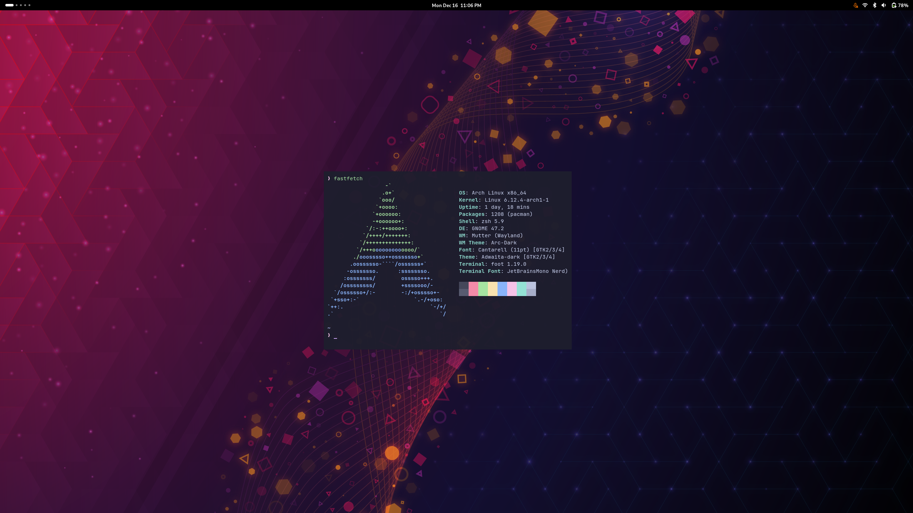
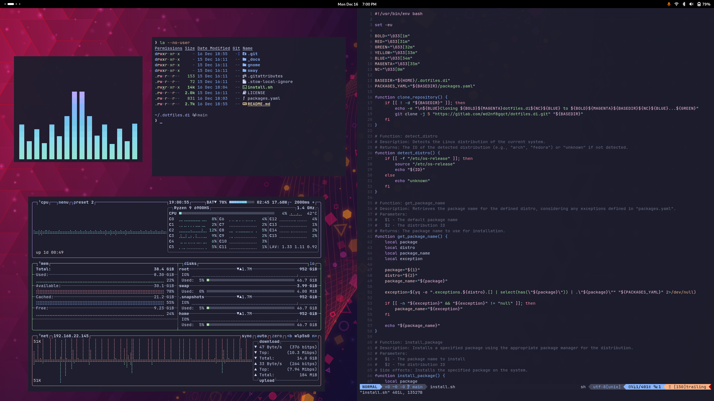
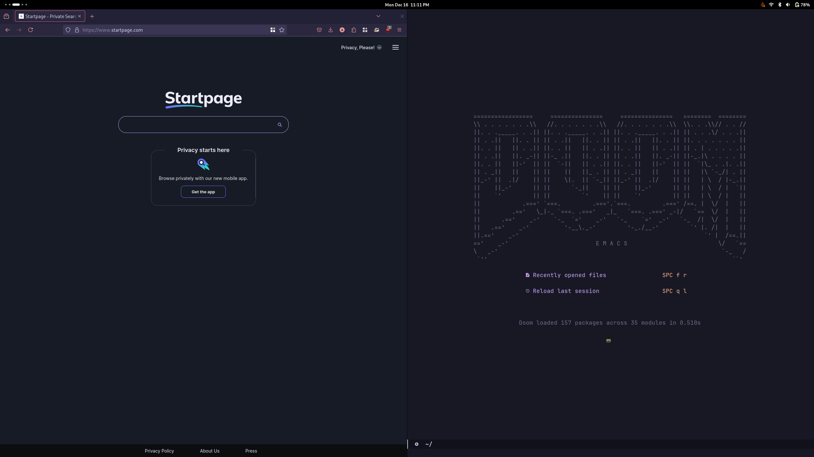

<div align="center">

<h3>dotfiles.di</h3>
<p>Desktop interface configurations for Hyprland, Niri, Sway, and GNOME — managed with GNU Stow.</p>
<p>
  <a href="https://opensource.org/licenses/BSD-3-Clause"></a>
  <a href="https://gitlab.com/wd2nf8gqct/dotfiles.di"></a>
  <a href="https://github.com/xuqkyv2lrk/dotfiles.di"></a>
  <a href="https://codeberg.org/iw8knmaDD5/dotfiles.di"></a>
</p>
<p>
  <a href="https://archlinux.org"></a>
  <a href="https://ubuntu.com"></a>
</p>
</div>


<br />

<div align="center">
<h3 style="margin-bottom: 0;">
<br />
GNOME</h3>
<div style="margin-top: 0; font-size: 0.9em;">
A modern, user-friendly desktop environment focused on simplicity&nbsp;&nbsp;&nbsp;[ <a href="https://github.com/GNOME/gnome-shell">GitHub</a> · <a href="https://help.gnome.org/">Guide</a> ]
</div>
<br />



</div>

<br />

<div align="center">
<h3 style="margin-bottom: 0;">
<br />
Hyprland
</h3>
<div style="margin-top: 0; font-size: 0.9em;">
A blazing fast tiling Wayland compositor with cat-like reflexes&nbsp;&nbsp;&nbsp;[ <a href="https://github.com/hyprwm/Hyprland">GitHub</a> · <a href="https://wiki.hyprland.org/">Wiki</a> ] 
</div>
<br />
</div>

<br />

<div align="center">
<h3 style="margin-bottom: 0;">
<br />
Sway</h3>
<div style="margin-top: 0; font-size: 0.9em;">
A tiling Wayland compositor and drop-in replacement for i3&nbsp;&nbsp;&nbsp;[ <a href="https://github.com/swaywm/sway">GitHub</a> · <a href="https://github.com/swaywm/sway/wiki">Wiki</a> ]
</div>
<br />
</div>

<br />

<div align="center">
<h3 style="margin-bottom: 0;">
<br />
Niri</h3>
<div style="margin-top: 0; font-size: 0.9em;">
A scrollable-tiling Wayland compositor&nbsp;&nbsp;&nbsp;[ <a href="https://github.com/YaLTeR/niri">GitHub</a> · <a href="https://github.com/YaLTeR/niri/wiki">Wiki</a> ]
</div>
<br />
</div>

<br />

<div align="center">
<h3 style="margin-bottom: 0;">
<br />
Noctalia</h3>
<div style="margin-top: 0; font-size: 0.9em;">
A Quickshell-based shell layer shared across all Wayland compositors&nbsp;&nbsp;&nbsp;[ <a href="https://quickshell.outfoxxed.me">Quickshell</a> ]
</div>
<div style="margin-top: 0.4em; font-size: 0.85em; color: #888;">
Handles the bar, launcher, notifications, lock screen, session management, screenshots, and wallpapers.
Compositor configs delegate all shell functionality to Noctalia via IPC rather than bundling their own tools.
</div>
<br />
</div>

## Usage

```bash
git clone https://gitlab.com/wd2nf8gqct/dotfiles.di.git ~/.dotfiles.di
cd ~/.dotfiles.di
```

Stow a specific desktop interface:

```bash
stow niri
stow hyprland
stow sway
stow gnome
```

For full machine setup — package installation, hardware configuration, and bootstrapping — see [dotfiles.bootstrap](https://gitlab.com/wd2nf8gqct/dotfiles.bootstrap).

## Repository layout

Each top-level directory is a collection of stow packages. Each sub-directory within it
is an independent stow package targeting `~/.config` (or `~/` for systemd and bin).

```
.
├── gnome/              # GNOME shell config and extensions
├── hyprland/
│   ├── bin/            # start-hypr launcher script
│   ├── hypr/           # Hyprland + hypridle + hyprlock config
│   ├── kvantum/        # Kvantum theme
│   ├── qt5ct/          # Qt5 theme
│   ├── gtk-2.0/
│   ├── gtk-3.0/
│   ├── gtk-4.0/
│   └── systemd/        # idle.service (hypridle)
├── niri/
│   ├── bin/            # start-niri launcher script
│   ├── hypr/           # hypridle + hyprlock config
│   ├── niri/           # Niri compositor config
│   ├── swappy/         # screenshot annotation config
│   ├── gtk-3.0/
│   ├── gtk-4.0/
│   ├── systemd/        # idle.service (hypridle)
│   └── xdg/            # mimeapps.list
├── quickshell/         # Noctalia shell layer config
└── sway/
    ├── bin/            # start-sway launcher script
    ├── hypr/           # hypridle config
    ├── kanshi/         # output management config
    ├── swappy/         # screenshot annotation config
    ├── sway/           # Sway compositor config
    ├── gtk-3.0/
    ├── gtk-4.0/
    ├── systemd/        # idle.service (hypridle)
    └── swaynag/        # swaynag dialog config
```

## License

BSD 3-Clause License. See [LICENSE](LICENSE) file.
