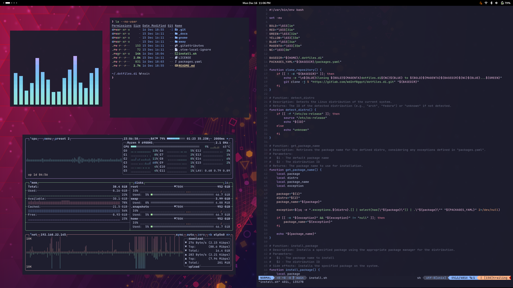

  
<h1 style="margin-top: 0px;">dotfiles.di</h1>

A personalized installation framework for configuring modern Wayland desktop interfaces across multiple Linux distributions.

 

<h3 style="margin-bottom: 0;">
 
GNOME</h3>

A modern, user-friendly desktop environment focused on simplicity&nbsp;&nbsp;&nbsp;[ <a href="https://github.com/GNOME/gnome-shell">GitHub</a> · <a href="https://help.gnome.org/">Guide</a> ]

 

 

<h3 style="margin-bottom: 0;">
 
Hyprland
</h3>

A blazing fast tiling Wayland compositor with cat-like reflexes&nbsp;&nbsp;&nbsp;[ <a href="https://github.com/hyprwm/Hyprland">GitHub</a> · <a href="https://wiki.hyprland.org/">Wiki</a> ] 

 

 

<h3 style="margin-bottom: 0;">
 
Sway</h3>

A tiling Wayland compositor and drop-in replacement for i3&nbsp;&nbsp;&nbsp;[ <a href="https://github.com/swaywm/sway">GitHub</a> · <a href="https://github.com/swaywm/sway/wiki">Wiki</a> ]

 

